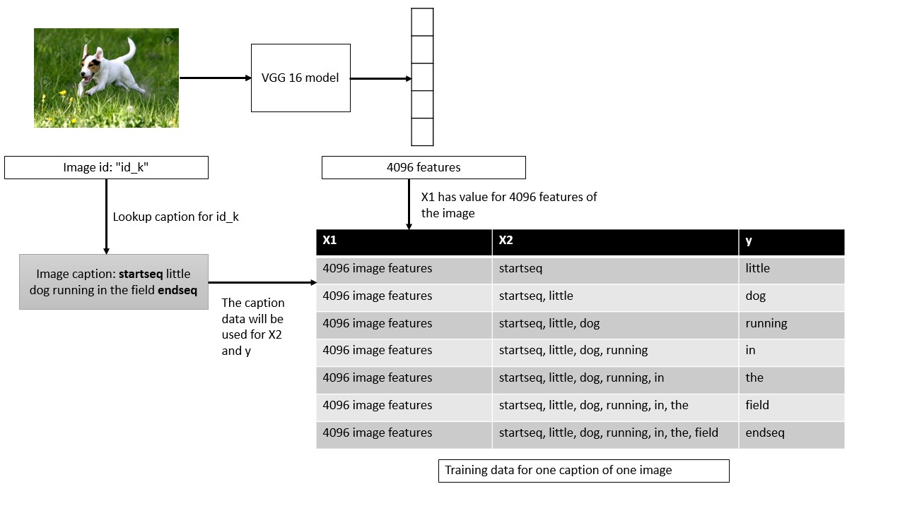

## AI-for-Web-Accessibility


This is the GitHub repository for my Masters dissertation titled: **Artificial Intelligence for Web Accessibility** which I completed as a part of my MSc in
Data Science course in the University of Southampton, UK under the supervision of Prof. Mike Wald

This project provided me an opportunity to apply my knowledge in machine Learning and Deep Learning to a problem that impacts people's lives.

The project mainly focuses on applying AI technologies to make the web more accessible to people who are differently abled. We take the knowledge and information
available on the internet for granted; but not everyone is so fortunate. This project is my modest attempt to work on this problem. There is a lot of scope to extend
this work and please feel free to contact me if you have any ideas/queries/suggestions!

LinkedIn: [Shaunak Sen](https://www.linkedin.com/in/shaunak-sen/)
Email: shaunak1105@gmailcom

The project mainly focuses on two parts:

1. Automatic Image Captioning System
2. Contextual Hyperlink Detection

This document only provides an overview. For details please refer to the full report [here](link)

### Automatic Image Captioning System

#### The Problem

The World Wide Web Consortium (W3C) is an organization responsible for developing and maintaining web standards such as HTML, CSS, etc. (57). The Web Content Accessibility Guidelines (WCAG) is developed through the W3C process and it aims to create and maintain a single set of guidelines and recommendations for individuals, organizations, and governments internationally to follow to make web content more accessible and inclusive, especially for people with disabilities (58; 64).

Guideline H37 (56) of the WCAG focuses on the proper use of alternative (alt) texts for images to help visually impaired people understand the message the image is trying to convey. Often developers fail to provide the above-mentioned alt texts and even if they do, the text does not really convey the message of the image.
Automatic Image captioning is a challenging task because it combines the workings of both CNNs and RNNs together. The CNN must understand the high-level features of the image and the RNN must translate these features into relevant captions

#### The Dataset

There are several options for a dataset of images accompanied by their corresponding captions. Some of these are Flickr8k (17), Microsoft COCO: Common objects in context (MSCOCO) (27), Conceptual captions dataset by Google (44). I have used the Flickr8k dataset for this task


#### Data Cleaning and pre-processing

In this task, we are dealing with both image data as well as textual data, which has been crowdsourced (17). Data cleaning and preprocessing is very important for the performance of the deep learning model.
The pre-processing steps vary for images and text. The pre-processing for the images involves:

1. Resize the images to dimensions: 224x224x3 - 224 is the image height and width (in pixels). 3 denotes the number of color channels (RGB)
2. Normalize the images by mean centering them. The mean RGB value was subtracted from each pixel value of the image

For natural language processing based tasks it is a good practice to clean text data and create a text cleaning pipeline using tools like python nltk (2; 6). The steps in the text cleaning pipeline suitable for our task include:

1. Tokenize the captions into separate words
2. Case Normalization - Convert all words to lowercase
3. Remove punctuations from the words
4. Remove non-alphanumeric characters from the words

For more traditional machine learning tasks additional steps like stemming and lemmatization need to be carried out, but because our model is going to have an embedding layer, it does not make sense to perform additional preprocessing (6).

#### Model for Image Classification

We use CNN generally for image classification.In this task,  we strip away the last layer of the CNN model.  This is because we areonly interested in the high-level features that the CNN learns from the image, and noton the final classification.  These features can be fed into the RNN along with part ofthe corresponding text of the caption.  The features and the text together are used topredict the next text in the caption 


For  the  purpose  of  this  task,  I  initially  tried  training  my  own  CNN  models,  but  theresults were not good.  Then,  I used Transfer learning,  where we re-use a model thathas already been developed for a certain task for a related but unidentical task (5).  Wecan use a pre-trained network for recognizing and classifying images and use it to getthe high-level features of the images.  Transfer learning helps reduce running time as themodel does not have to be trained from scratch. 

VGG 16 was selected as the final model and it was used it to extract the photofeatures.  Each feature has a dimensionality of **4096**.

#### Optimization of the VGG-16 model

Running each image through the entire VGG network takes a long time and had scopefor optimization.  The process was:

```
Assign  a unique  id  to  each  image  in  the  dataset

Create  a  dictionary  of  form{i d    :  [ . . . ,  features ,]}

For  each  image
    Run the  image  through  the VGG network  except  for  the  last  layer
    Extract  the  features  for  that  image
    Store  the  image  id  as  the  key and  the  list  of  features  as  the  value  in the  dictionary
    Return  the  formed  dictionary
```

Once the dictionary is formed, we can easily look up the corresponding features for animage using the id of the image

At the end of this step,we have computed the high-level features of an image.Animportant point to note here is that the choice of stripping away exactly one layer fromthe model is experimental.  As discussed in the prev section 2.1, as we go deeper into theCNN, it learns more complicated features.  One can argue that it might be a good ideato explore the results after stripping away the last two layers so that slightly less specificfeatures are taken into account.  I tried this process, however, the performance of themodel by stripping away 2 layers reduced dramatically and the network became underfitted. That means **by stripping away 2 layers the network could not understandthe complexities of the image well enough to associate the features with the captions.**


#### Creating the training set

The next step is to create the dataset that will combine the image features and the cap-tions together which we can then feed into our RNN model.  While generating captionswe have to set a limit for the model to stop predicting the next word in the caption.We do this by appending two special tokensstartseqandendseqto the beginning andend of each caption respectively.  These tokens tell the system when to start and whento stop predicting the sequence of words.



X1, X2 and y are now our training lists.  The model should receive the pair[X1, X2]and predicty. [X1, X2] are like the photo features and the corresponding tokens fromthe caption combined andyis the next token that the model should learn to predict.Thesame algorithm is used to create the corresponding test sequences.

The figure represents X2 and y as  words  for  readability  and  understanding  purpose.However  neural  networks  cannot  understand  text  features.   We  have  to  encode  thesenumbers in some form.  The paper (31) discusses the benefits of using word embeddings.So we convert the input text into a one-hot vector and then feed them into an Embeddinglayer, which is built into Keras (8).  This layer basically converts these sparse one-hotvectors into a dense vector representation by embedding them into a lower dimension.

The  choice  of  how  many  dimensions  to  use  for  embedding  is  arbitrary,  and  throughexperimentation it was found that300dimensions gave the best results.

#### Model for Image Captioning

As mentioned in (65), the task of automatically generating captions from an image is very similar to the task of machine translation.  Encoder-decoder based architectures have achieved  excellent  results  in  machine  translation  (7).   Encoder-decoder  based  modelsgenerally consist of an encoder RNN, which maps the input sequence to a vector of fixedlength, and the decoder maps this representation to a target sequence. This architecture,when incorporated with attention-based networks like LSTM (16) achieve state-of-the-art  results  in  machine  translation  tasks.   Also,  the  models  are  very  interpretable  andquite simple compared to other complex models for similar tasks. The final model has been generated absed on a number of experiments 


#### Generating the captions

Now,  we  have  our  final  model  which  has  been  trained  on  6000  images  and  their  cor-responding captions.  We can generate the captions on the test set (1000 images) andevaluate the results.  To generate the captions we use the following algorithm:


At this stage, we have the captions for all the 1000 images in the test set.

#### Evaluating the model

(50)  mentions  a  variety  of  metrics  to  evaluate  the  quality  of  the  generated  captions. Initially, the metric Bilingual Evaluation Understudy Score (BLEU) (36) was used forevaluating  the  generated  captions  against  the  real  captions  in  the  test  dataset.   As discussed in (4), BLEU offers some advantages that apply to this project like: 
1.  Simple to understand
2.  Easy to implement - nltk (14) in python has an implementation of BLEU
3.  It can be used to compare the performance of our model against the model de-scribed in (65) and (50)
4.  It correlates highly with human evaluation
5.  The score is calculated irrespective of the order of the words
6.  A cumulative BLEU score can be calculated based on N-gram (62) matches

The metric ranges from 0 to 1; 1 being a perfect match.  We can calculate cumulative BLEU score for N-grams.  For example, while considering the BLEU-2 score we see thepercentage of matching 2-grams in the real and generated caption.  Using this metric, our final model Figure 3.5 has the following scores:

- BLEU-1:  0.535031
- BLEU-2:  0.282928
- BLEU-3:  0.196293
- BLEU-4:  0.091624

#### Sample results

Some examples of the captions generated by our model are shown in Figure 3.6.  It canbe seen that there are cases when the model gets the caption correct (green), partiallycorrect (yellow) and completely incorrect (red) 


