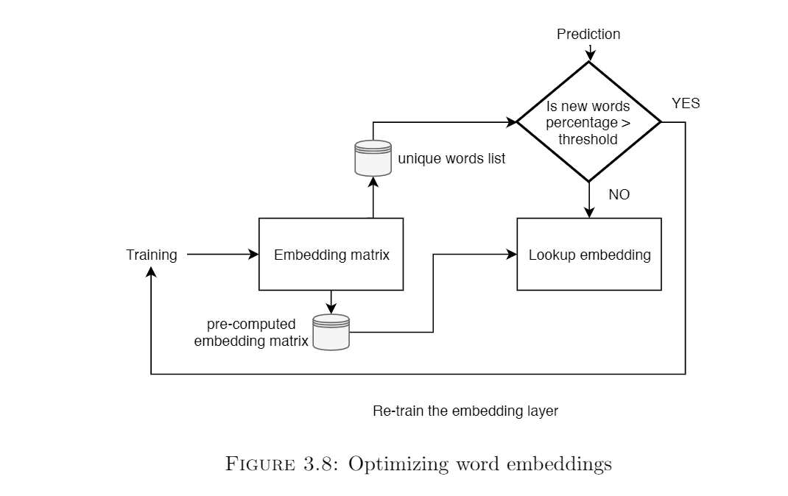

## Artificial Intelligence for Web Accessibility


This is the GitHub repository for my Masters dissertation titled: **Artificial Intelligence for Web Accessibility** which I completed as a part of my MSc in
Data Science course in the University of Southampton, UK under the supervision of Prof. Mike Wald

This project provided me an opportunity to apply my knowledge in machine Learning and Deep Learning to a problem that impacts people's lives.

The project mainly focuses on applying AI technologies to make the web more accessible to people who are differently abled. We take the knowledge and information
available on the internet for granted; but not everyone is so fortunate. This project is my modest attempt to work on this problem. There is a lot of scope to extend
this work and please feel free to contact me if you have any ideas/queries/suggestions!

LinkedIn: [Shaunak Sen](https://www.linkedin.com/in/shaunak-sen/)
Email: shaunak1105@gmailcom

The project mainly focuses on two parts:

1. Automatic Image Captioning System
2. Contextual Hyperlink Detection

This document only provides an overview. For details please refer to the full report [here](https://github.com/ShaunakSen/AI-for-Web-Accessibility/blob/master/AI_for_Web_Accessibilty%20-%20MSc%20Project%20Dissertation.pdf)

### Automatic Image Captioning System

#### The Problem

The World Wide Web Consortium (W3C) is an organization responsible for developing and maintaining web standards such as HTML, CSS, etc. (57). The Web Content Accessibility Guidelines (WCAG) is developed through the W3C process and it aims to create and maintain a single set of guidelines and recommendations for individuals, organizations, and governments internationally to follow to make web content more accessible and inclusive, especially for people with disabilities (58; 64).

Guideline H37 (56) of the WCAG focuses on the proper use of alternative (alt) texts for images to help visually impaired people understand the message the image is trying to convey. Often developers fail to provide the above-mentioned alt texts and even if they do, the text does not really convey the message of the image.
Automatic Image captioning is a challenging task because it combines the workings of both CNNs and RNNs together. The CNN must understand the high-level features of the image and the RNN must translate these features into relevant captions

#### The Dataset

There are several options for a dataset of images accompanied by their corresponding captions. Some of these are Flickr8k (17), Microsoft COCO: Common objects in context (MSCOCO) (27), Conceptual captions dataset by Google (44). I have used the Flickr8k dataset for this task


#### Data Cleaning and pre-processing

In this task, we are dealing with both image data as well as textual data, which has been crowdsourced (17). Data cleaning and preprocessing is very important for the performance of the deep learning model.
The pre-processing steps vary for images and text. The pre-processing for the images involves:

1. Resize the images to dimensions: 224x224x3 - 224 is the image height and width (in pixels). 3 denotes the number of color channels (RGB)
2. Normalize the images by mean centering them. The mean RGB value was subtracted from each pixel value of the image

For natural language processing based tasks it is a good practice to clean text data and create a text cleaning pipeline using tools like python nltk (2; 6). The steps in the text cleaning pipeline suitable for our task include:

1. Tokenize the captions into separate words
2. Case Normalization - Convert all words to lowercase
3. Remove punctuations from the words
4. Remove non-alphanumeric characters from the words

For more traditional machine learning tasks additional steps like stemming and lemmatization need to be carried out, but because our model is going to have an embedding layer, it does not make sense to perform additional preprocessing (6).

#### Model for Image Classification

We use CNN generally for image classification.In this task,  we strip away the last layer of the CNN model.  This is because we areonly interested in the high-level features that the CNN learns from the image, and noton the final classification.  These features can be fed into the RNN along with part ofthe corresponding text of the caption.  The features and the text together are used topredict the next text in the caption 


For  the  purpose  of  this  task,  I  initially  tried  training  my  own  CNN  models,  but  theresults were not good.  Then,  I used Transfer learning,  where we re-use a model thathas already been developed for a certain task for a related but unidentical task (5).  Wecan use a pre-trained network for recognizing and classifying images and use it to getthe high-level features of the images.  Transfer learning helps reduce running time as themodel does not have to be trained from scratch. 

VGG 16 was selected as the final model and it was used it to extract the photofeatures.  Each feature has a dimensionality of **4096**.

#### Optimization of the VGG-16 model

Running each image through the entire VGG network takes a long time and had scopefor optimization.  The process was:

```
Assign  a unique  id  to  each  image  in  the  dataset

Create  a  dictionary  of  form{i d    :  [ . . . ,  features ,]}

For  each  image
    Run the  image  through  the VGG network  except  for  the  last  layer
    Extract  the  features  for  that  image
    Store  the  image  id  as  the  key and  the  list  of  features  as  the  value  in the  dictionary
    Return  the  formed  dictionary
```

Once the dictionary is formed, we can easily look up the corresponding features for animage using the id of the image

At the end of this step,we have computed the high-level features of an image.Animportant point to note here is that the choice of stripping away exactly one layer fromthe model is experimental.  As discussed in the prev section 2.1, as we go deeper into theCNN, it learns more complicated features.  One can argue that it might be a good ideato explore the results after stripping away the last two layers so that slightly less specificfeatures are taken into account.  I tried this process, however, the performance of themodel by stripping away 2 layers reduced dramatically and the network became underfitted. That means **by stripping away 2 layers the network could not understandthe complexities of the image well enough to associate the features with the captions.**


#### Creating the training set

The next step is to create the dataset that will combine the image features and the cap-tions together which we can then feed into our RNN model.  While generating captionswe have to set a limit for the model to stop predicting the next word in the caption.We do this by appending two special tokensstartseqandendseqto the beginning andend of each caption respectively.  These tokens tell the system when to start and whento stop predicting the sequence of words.


X1, X2 and y are now our training lists.  The model should receive the pair[X1, X2]and predicty. [X1, X2] are like the photo features and the corresponding tokens fromthe caption combined andyis the next token that the model should learn to predict.Thesame algorithm is used to create the corresponding test sequences.

The figure represents X2 and y as  words  for  readability  and  understanding  purpose.However  neural  networks  cannot  understand  text  features.   We  have  to  encode  thesenumbers in some form.  The paper (31) discusses the benefits of using word embeddings.So we convert the input text into a one-hot vector and then feed them into an Embeddinglayer, which is built into Keras (8).  This layer basically converts these sparse one-hotvectors into a dense vector representation by embedding them into a lower dimension.

The  choice  of  how  many  dimensions  to  use  for  embedding  is  arbitrary,  and  throughexperimentation it was found that300dimensions gave the best results.

#### Model for Image Captioning

As mentioned in (65), the task of automatically generating captions from an image is very similar to the task of machine translation.  Encoder-decoder based architectures have achieved  excellent  results  in  machine  translation  (7).   Encoder-decoder  based  modelsgenerally consist of an encoder RNN, which maps the input sequence to a vector of fixedlength, and the decoder maps this representation to a target sequence. This architecture,when incorporated with attention-based networks like LSTM (16) achieve state-of-the-art  results  in  machine  translation  tasks.   Also,  the  models  are  very  interpretable  andquite simple compared to other complex models for similar tasks. The final model has been generated absed on a number of experiments 


#### Generating the captions

Now,  we  have  our  final  model  which  has  been  trained  on  6000  images  and  their  cor-responding captions.  We can generate the captions on the test set (1000 images) andevaluate the results.  To generate the captions we use the following algorithm:


At this stage, we have the captions for all the 1000 images in the test set.

#### Evaluating the model

(50)  mentions  a  variety  of  metrics  to  evaluate  the  quality  of  the  generated  captions. Initially, the metric Bilingual Evaluation Understudy Score (BLEU) (36) was used forevaluating  the  generated  captions  against  the  real  captions  in  the  test  dataset.   As discussed in (4), BLEU offers some advantages that apply to this project like: 
1.  Simple to understand
2.  Easy to implement - nltk (14) in python has an implementation of BLEU
3.  It can be used to compare the performance of our model against the model de-scribed in (65) and (50)
4.  It correlates highly with human evaluation
5.  The score is calculated irrespective of the order of the words
6.  A cumulative BLEU score can be calculated based on N-gram (62) matches

The metric ranges from 0 to 1; 1 being a perfect match.  We can calculate cumulative BLEU score for N-grams.  For example, while considering the BLEU-2 score we see thepercentage of matching 2-grams in the real and generated caption.  Using this metric, our final model Figure 3.5 has the following scores:

- BLEU-1:  0.535031
- BLEU-2:  0.282928
- BLEU-3:  0.196293
- BLEU-4:  0.091624

#### Sample results

Some examples of the captions generated by our model are shown in Figure 3.6.  It canbe seen that there are cases when the model gets the caption correct (green), partiallycorrect (yellow) and completely incorrect (red) 


#### BLEU metrics - The problem

Even though the BLEU metrics for our model look promising a closer inspection revealeda problem.The  BLEU  scores  between  the  real  and  generated  captions  as  shown  in  table  3.3  arevery low although the captions are quite close to the real ones.  The reason why BLEUscore fails to capture this is because it tries to match every word exactly consideringvarious N-grams.  It fails to understand the words in their context and synonyms. 

#### A Proposed Solution

It is clear from the above discussion that we would require a more representative methodof evaluating the generated captions.  One possible solution is to use a word embeddingtechnique like word2vec (31).  The motivation behind using word embeddings for thisproject is:

1.  When words are trained by deep learning algorithms, they should be representedin a manner which can capture the context in some manner

2.  Detecting phrases which have close context is essential not only for evaluating the current model but also for developing the second part of this project.  

3. By embedding the words in vector space we can apply metrics like Cosine similarity between  them  which  can  give  us  a  better  idea  about  the  similarity  than  BLEUs cores or Euclidean similarity.  Cosine similarity is insensitive to the relative sizesof the documents (28)

##### Working of a word embedding model - word2vec

For this project, we use the famous word embedding technique - word2vec (31). Word2vecis a shallow neural network that learns the association between the words (52).  FromFigure 3.7, we can see that the model takes as input the one-hot encoded form of thewords.  The size of this input vector is the same as our vocabulary size.  Then there is ahidden layer, the size of which determines the vector size in which all the words will beembedded.  The final output layer again is the same size as the vocabulary, but usuallyhas a softmax (63) activation function, which outputs a probability distribution of all possible words in the vocabulary.  By training this network on a large corpus of words,it gradually learns to maximize the probability of words which are in close proximity toit.  An important assumption that this model makes is that words in close proximity areoften similar or contextual.  Finally, after the network has learned the associations, wecan extract the hidden (embedding) dimension, and words which have similar contextwill represent similar vector space embeddings.


##### Word Movers Distance

Now  that  we  have  a  brief  idea  about  how  word2vec  works,  we  can  go  back  to  ourproblem of understanding if the generated captions are similar to the original captionsor not.  Basically, we have to compare two sentences, and in the field of natural languageprocessing, sentences are often referred to as documents.  So we need a metric that cangive us a similarity score based on the distances between the documents, incorporatingthe features of word2vec.

Word Movers Distance (WMD) (23) is such a metric.  WMD utilized word2vec embed-dings.  The words and hence, the documents can be represented in vector space.  WMDcomputes the cumulative distance between two documents in vector space as the mini-mum distance the cloud of points for one document will need to travel to merge with thecloud of points for the above document.  Because it uses word2vec embeddings, similarwords will be close together in vector space, and, as a result, similar documents will haveless WMD between them. 

The motivation for using WMD for our use case of identifyingthe similarity between captions are:

1. Can leverage pre-trained embeddings of the word2vec model
2. Can  capture  the  semantic  similarity  between  documents  that  other  metrics  likeTF-IDF (23; 37) fail to do
3. The algorithm is hyperparameter free - so a lot of time and memory for hyperpa-rameter optimization can be saved.  As discussed in section 1.3, RAM managementis a crucial factor
4. The algorithm can be easily implemented using the gensim package in python (39)

####  Implementing the proposed solution

To implement WMD, we use pre-trained word2vec embeddings from the Google Newsdataset (12).  These are a set of pre-trained vectors, each representing a unique word,which have been extracted from Google news data.  There are about 100 billion uniquewords, and the vector (embedding) size is 300.  It is a safe assumption to consider that all of the words in our dataset is a part of this massive 100 billion words dataset, so wedo not have to train our own word2vec model for this.  Another important catch whilecomputing WMD is it considers Euclidean distance (60), and not Cosine Similarity (28).So if two documents have different lengths the Euclidean distance will be large, so wenormalize the embedded vectors so that they have the same lengths.    


The implementation of the WMD distance on our test dataset is as follows:


The average WMD Distance score is **1.17**, which suggests that the generated captionsare quite close to the original ones.  Through experimentation,  we can see that if thecaptions are not similar the WMD score is generally over **1.25**, and often over **1.5**

#### Results

> In  table  3.3,  we  had  observed  few  samples  of  real  and  generated  captions  for  whichthe N-gram BLEU scores were very less, even though the captions were quite similar.We compute the WMD Distance metric between these captions using pre-trained GoogleNews word embeddings (12), and the results are summarized in table 3.4.  It is clear fromthe above results that applying WMD metric to the captions generate better results.


### Some optimizations for deploying

We  optimized  the  CNN  part  of  the  model  by  pre-computing  and  storing  the  image  features.   When  we  deploy  the  model  to  the  web,we  need  to  consider  the  running  time  of  the  model.   For  that,  we  should  store  all the variables, data structures and weights of the models which have been trained and optimized on disk so that while predicting, the application can just read from these file sand  run  the  data  through  the  model  to  get  the  predictions.   We  should  not  have  to re-create the datasets or re-train the model every time.  Most importantly, the creation of the training dataset takes a long time (30 mins on 25GBRAM) and should be stored on disk.



#### Optimizing word embeddings

Our model has an embedding layer of fixed dimensionality which learns dense vector space embeddings of words. Once trained on the whole dataset,**8763** words are learned by the model.  This is a significant number and it does not make sense to precompute the embeddings every time.  So, the embedding matrix once learned can be stored as a numpy array of dimensionality(vocabularysize, embeddingsize)and then be stored on disk as a pickle, which the model can refer to while training.  This significantly reduced the training time of the model (by almost 10 minutes on a batchof 1000 new images for 20 epochs).  Also, to make this approach work, we keep a list of words in our vocabulary.  If **newer data comes in and the percentage of words that are out-of-vocabulary is beyond a particular threshold, we re-train the embedding**.  This process is summarized in Figure 3.8.

#### Using model checkpoints

Also, because the model will be deployed on the cloud, we may need to re-train the model as we receive new data. So we should always ensure that we are using the best model for the predictions. An easy way to do this is to monitor the loss via callbacks. Callbacks allow us to monitor important statistics of a model like loss and accuracy while training [29]. Using callbacks we can create checkpoints of the model  The way we do this is: 

```
Set the format of the model file as: model-ep{epoch:03d}-loss{loss:.3f}-val_loss{val_loss:.3f}.h5
Create a new ModelCheckpoint instance
Set the appropriate parameters:
    monitor = ‘val_loss’
    save_best_only = True: Only save the model with the lowest validation score
    mode = ‘min’: overwrite the current file if the model has the minimum validation loss
Set the checkpoint as a callback while training the model
```

> Thus, only the model with the lowest validation loss will be stored on disk. If the current model has a lower validation loss, the model on disk will be replaced by the current one.

#### File management


Table 3.5 shows a possible configuration of the files that have to be maintained on disk, their types and refresh rates. Generally files of sizes less than 1GB can be maintained as pickle files. Files larger than that have to be stored in HDF (HD5) format.


Now that we have developed a system for automatically captioning images and we have also applied metrics to test the quality of the generated captions keeping in mind the complexities of natural language. Additionally, we explore some additional extended features that we can provide users to improve their experiences on the web.


---

### Object Detection

Image captions provide a visually impaired user with an overview of what the image is trying to convey. However, what we noticed was that the captions generated were often vague, like “children playing in the park” instead of “three children playing with football in the park”. One way to do this would be to incorporate an attention mechanism (65) in our model. However, this would not solve the problem perfectly as the results in (65) and (50) are quite comparable. 

A solution is to use object detection. As mentioned, image captioning provides a general overview of what the image is trying to convey. The motivation behind this is that to get a detailed understanding of what is going on in the image, users can toggle through the objects in the image and the system will read out what that object is.

There are many object detection libraries and APIs available, but we use Microsoft Azure Vision API (30 ) for this purpose, due to the following reasons:

1. The API returns the objects detected as well as the coordinates of the bounding boxes
2. The API returns a confidence level of the detection
3. The API returns parent objects for any detected object. For e.g bicycle helmet - helmet - headwear. bicycle helmet is the detected object here.
4. The API returns the data in JSON (JavaScript Object Notation) format which is easy to interpret using JavaScript and Python

A sample response from the API, when the model has detected the object \textbf{dog} is shown below:

``` javascript

{
    "url": url for the image,
    "response": {
        "objects": [{
          "rectangle": {
            "x": 154,
            "y": 23,
            "w": 102,
            "h": 122
          },
          "object": "dog",
          "confidence": 0.845,
          "parent": {
            "object": "mammal",
            "confidence": 0.849,
            "parent": {
              "object": "animal",
              "confidence": 0.906
            }
          }
        }],
        "requestId": unique request id,
        "metadata": {
          "width": 356,
          "height": 277,
          "format": "Png"
        }
      }
}
```

Some of the features that this application should have are the following:

1. The image should have a generic caption which will be the output of the image captioning model
2. If the user wants, they can explore more. On the click of a button, the object detection API should be executed 
3. The bounding boxes for each object in the image should be drawn
4. User can hover over these objects and the information should be provided via text and speech
5. User can also toggle through the objects by pressing a specific key (completely blind users will not know where to hover on the image)

Keeping these features in mind, a demonstration application was built. The link to this application is: 
[https://codepen.io/shaunak1105/full/dybZEXa](https://codepen.io/shaunak1105/full/dybZEXa)


The above figure shows how users can interact with the app. The information about the objects detected is provided both by text and speech. The bounding boxes are also overlaid on the image. Users can choose to hover over the objects or toggle through them by pressing the `space` key.


### Relevance of image on a web page

Often, we come across web sites which are cluttered with images. These images may be present for the purpose of advertisements and they do not convey any real meaning to the topic being discussed. These images are thus confusing and distracting and for someone who is using screen readers, the experience will be worse. 

The motivation behind this extension is to detect these irrelevant images from the text surrounding it and automatically flag these images so that they can be ignored by the screen readers. 

We have already built an image captioning system and evaluated metrics for testing caption-to-caption similarity using WMD. To extract the text surrounding the image, we can consider a window of `w` words around the image tag. So we have the generated caption, the words surrounding the image and we want to apply WMD to detect of the text and image caption are in context to each other or not.

We initially pre-process both the caption text and the surrounding text . Then we computed the WMD score. however, we were not getting proper results (the scores were always higher than 1.25).

The caption text does not have a fixed length of words. So we cannot directly consider it as a document and compute WMD between the texts. Additionally, only a part of the surrounding text might be discussing the caption. So if we simply compute the WMD between the caption and surrounding text, it will return a high value, but that does not mean that they are not similar.

However,**at least one part** of the surrounding text must be discussing the caption. We can detect this by splitting both the surrounding text and the caption into N-grams (62). For example, if the caption has 5 words, we can consider 2-gram sequences, 3-gram sequences, 4-gram sequences, and 5-gram sequences between the caption and the surrounding text and then compute WMD similarity. The intuition is that at least one of these N-grams between the caption and the surrounding text should have a close match i.e have less WMD score.

The algorithm to do this is described below:

```
Preprocess both the caption text and surrounding text
Compute length of caption
For i in range of 2 to length of caption:
    Create i-grams of caption text
    Create i-grams of surrounding text
    For each such i-gram pair
        Compute WMD between caption i-gram and surrounding i-gram
            If WMD < 1.15
                The caption is similar
                    Return true
            Else
                continue
Return false - the caption is not similar
```


This process is visualized in teh figure below. It is clear for this scenario, simply computing the WMD score between the caption and surrounding text resulted in a high score of **1.34**. However using the algorithm discussed, we get a much lower score and we can also visually see which parts of the text received a close match (shown in green in the figure). By removal of stopwords, we have ensured that common words are not taken into the formation of N-grams.